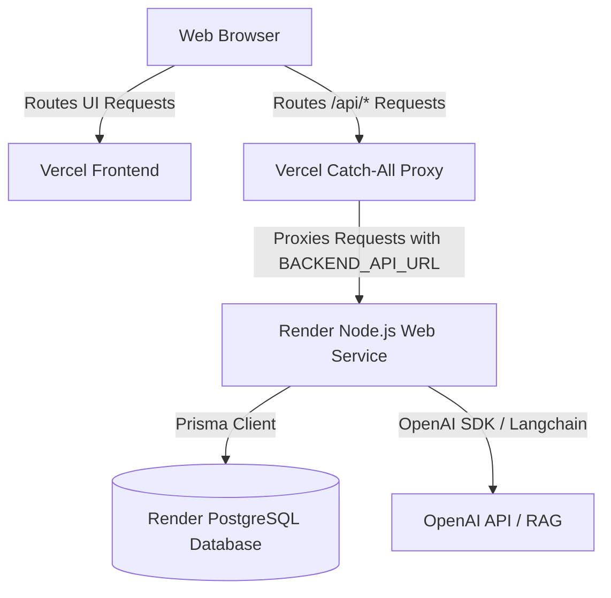

# Manual Deployment Guide: Render Web Service & Vercel

This guide outlines the step-by-step process for deploying the **AI Admission Counselor** application manually using a **Render Web Service** (for the backend), an **existing Render PostgreSQL database**, and **Vercel** (for the frontend React Vite application).

---

## Architecture Overview

---

## Step 1: Connect Existing PostgreSQL Database

The application connects to your existing Render PostgreSQL database using Prisma ORM.

1. Go to your **Render Dashboard** and select your existing PostgreSQL database service.
2. Locate the **External Database URL** (or **Internal Database URL** if deploying in the same Render region).
3. Copy the URL string (starts with `postgresql://`). This value will be configured as the `DATABASE_URL` environment variable on the backend service.

---

## Step 2: Create Render Web Service

Deploy the backend Express application as a standard Node.js Web Service.

1. On the **Render Dashboard**, click **New +** -> **Web Service**.
2. Select your GitHub repository.
3. Configure the following service settings:
   - **Name:** `ai-admission-backend`
   - **Region:** Select the same region as your existing database for lower latency.
   - **Language:** `Node`
   - **Root Directory:** `.` (Keep as the repository root, so Render can access all workspace workspaces).
   - **Branch:** `main` (or your preferred production branch).

---

## Step 3: Configure Environment Variables on Render

In the Web Service configuration flow, scroll down to the **Environment Variables** section (or navigate to the **Env Groups / Variables** tab after creation) and add the following:

| Environment Variable | Source / Action             | Description                                                                                                                     |
| :------------------- | :-------------------------- | :------------------------------------------------------------------------------------------------------------------------------ |
| `DATABASE_URL`       | **Enter Manually**          | The connection string copied in Step 1 (e.g. `postgresql://...`).                                                               |
| `JWT_SECRET`         | **Enter Manually**          | A long, secure random key for signing JWT access tokens.                                                                        |
| `JWT_REFRESH_SECRET` | **Enter Manually**          | A long, secure random key for signing JWT refresh tokens.                                                                       |
| `NODE_ENV`           | **Enter Manually**          | Set to `production`.                                                                                                            |
| `OPENAI_API_KEY`     | **Enter Manually**          | Your OpenAI API key for counselor chatbot, RAG embeds, STT, and TTS.                                                            |
| `LOG_LEVEL`          | **Enter Manually**          | Set to `info` or `warn`.                                                                                                        |
| `FRONTEND_URL`       | **Enter Manually**          | The production Vercel frontend URL (e.g. `https://your-app.vercel.app`). _Update this once the Vercel deployment is completed._ |
| `PORT`               | **Generated Automatically** | Render automatically provisions and sets the `PORT` variable. The backend binds to this port dynamically.                       |
| `NODE_VERSION`       | **Enter Manually**          | Set to `22` (Render will build the project using Node.js v22).                                                                  |

## Step 4: Configure Build Command on Render

Set the build command in the Web Service configuration to build both the shared package and backend workspace:

- **Build Command:** `npm install --production=false && npm run build -w shared && npm run build -w backend`

_How it works:_
The build command first runs `npm install --production=false` (or `npm ci --production=false`) to bypass `NODE_ENV=production` during the build phase and ensure all devDependencies (like TypeScript and Zod) are fully installed in the monorepo workspaces. It then compiles the shared library and backend code in order, automatically generating the Prisma Client bindings.

---

## Step 5: Configure Start Command on Render

Set the start command to apply database schema migrations and boot the server:

- **Start Command:** `npx prisma migrate deploy --schema=backend/prisma/schema.prisma && npm run start -w backend`

_How it works:_
Render will first run pending database migrations using `prisma migrate deploy` to safely align the schema without database resets. Once successful, it boots the Express server from `backend/dist/index.js` using the workspace runner.

---

## Step 6: Deploy Backend & Retrieve Domain

1. Under the **Health Check Path** section of the Web Service settings, enter: `/api/health`.
2. Click **Create Web Service**.
3. Wait for the build and deployment logs to show that the service is running.
4. Copy the public Render URL assigned to your service (e.g., `https://ai-admission-backend.onrender.com`).

---

## Step 7: Deploy Frontend on Vercel

The frontend React application is deployed on Vercel, utilizing a catch-all serverless function to proxy requests without exposing cross-origin issues or hardcoding backend URLs in the compiled Vite assets.

1. Go to the [Vercel Dashboard](https://vercel.com/) and click **Add New** -> **Project**.
2. Import your GitHub repository.
3. Keep the root directory as `.` (repository root) to allow workspace resolution, and use these configurations:
   - **Framework Preset:** `Vite`
   - **Build Command:** `npm run build -w frontend`
   - **Output Directory:** `frontend/dist`
4. Add the following **Environment Variable**:
   - **Key:** `BACKEND_API_URL`
   - **Value:** `https://ai-admission-backend.onrender.com` _(The Render Web Service URL copied in Step 6)_
5. Click **Deploy**. Vercel will build the frontend and serve it.
6. Once deployed, copy your Vercel public domain (e.g., `https://ai-admission-frontend.vercel.app`) and update the `FRONTEND_URL` variable in your Render Web Service.

---

## Step 8: Verify Application

1. Open your Vercel URL in a browser.
2. Go to the registration page (`/register`) and fill out the form (Full Name, Email, Password, Phone, Nationality).
3. Click **Register**. Confirm that a student account is created successfully without any API errors.
4. Log out and log in again on the `/login` page to verify that session tokens are successfully issued and stored.

---

## Step 9: Troubleshooting

### Issue 1: PrismaClientInitializationError during Deploy

- **Symptoms:** Deployment logs show database connection errors or migration timeouts.
- **Solution:** Verify your `DATABASE_URL` connection credentials on Render. Ensure that the database is active and allows external connections from Render's IPs.

### Issue 2: Registration or Login Fails with `500 Bad Gateway`

- **Symptoms:** Frontend loads, but form submissions result in a `500` status code in the console.
- **Solution:** Check if `BACKEND_API_URL` is set correctly in Vercel's settings and contains the full Render Web Service URL (including `https://` but _no_ trailing slash). Ensure your Render backend is running by navigating to `https://your-backend.onrender.com/api/health`.

### Issue 3: CORS Blocked Requests

- **Symptoms:** Browser console logs block errors regarding CORS headers.
- **Solution:** Ensure the `FRONTEND_URL` environment variable on your Render Web Service matches the exact active Vercel domain (e.g., `https://ai-admission-frontend.vercel.app` - no trailing slash).
